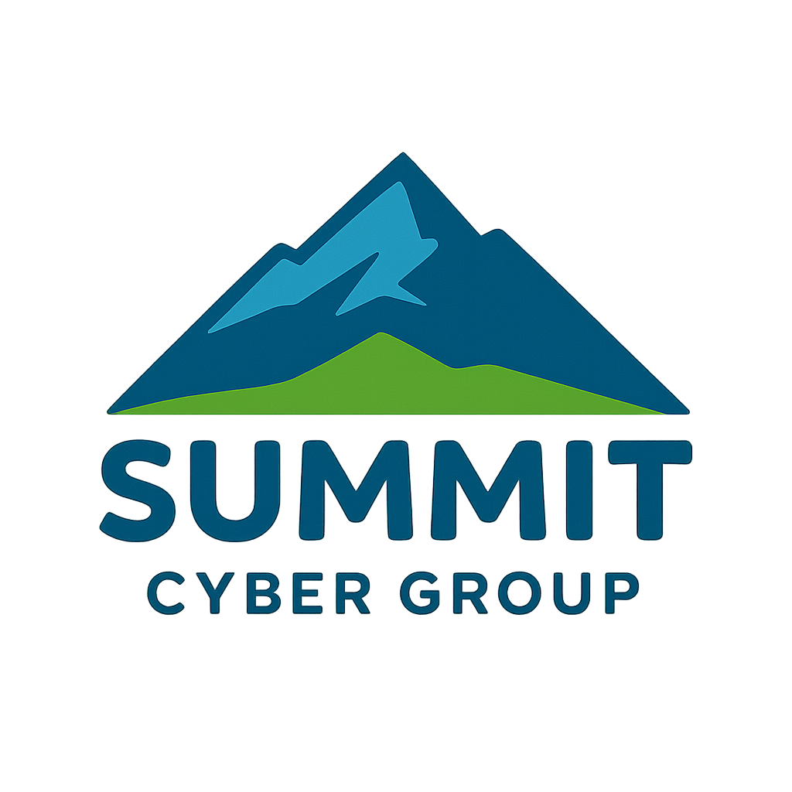

# d1sc0v3r

<p align="left">
  
</p>

**Local-only network discovery and triage for authorized penetration tests.**

[](LICENSE)
[](https://summitcyber.io)

Paste subnets → fast sweep (`masscan` + `fping`) → deep `nmap -sV` on
interesting hosts → rule-based categorization + priority scoring → optional
local-LLM enrichment that classifies ambiguous hosts and writes a "why this
matters" story for critical / high targets. Runs entirely in Docker on your
machine. Exports an Obsidian-flavored Markdown report per engagement.

> ⚠️ Use **only** against networks you have written authorization to test.

---

## Quick start

You need **Docker** (with Compose). For LLM features you also need **Ollama**
with `qwen3:8b` — by default we assume it runs on the **same machine** as
d1sc0v3r, so there's nothing to configure. If you don't have Ollama yet, the
tool still runs; LLM enrichment just shows offline.

### 1. (optional) Install Ollama and pull the model

```bash
# Linux
curl -fsSL https://ollama.com/install.sh | sh

# macOS
brew install ollama && open -a Ollama

# Windows: download from https://ollama.com/download

# Then on every platform:
ollama pull qwen3:8b
```

### 2. Launch d1sc0v3r

**Linux / Kali:**
```bash
git clone https://github.com/uNdoNe001/d1sc0v3r.git
cd d1sc0v3r
docker compose up -d --build
```

**Windows (Docker Desktop):**
```powershell
git clone https://github.com/uNdoNe001/d1sc0v3r.git
cd d1sc0v3r
docker compose -f docker-compose.windows.yml up -d --build
```

### 3. Open the dashboard

→ **<http://127.0.0.1:8040>**

Paste subnets, pick a profile, click **Launch sweep**. Done.

---

## What you get

- **One-paste discovery** across any number of CIDR subnets or bare IPs.
- **Fast/deep two-stage scan** — masscan/fping find what's live, nmap captures
  service versions + OS only on hosts worth the cost.
- **SMB / NTLM aware** — auto-fires `smb-protocols`, `smb-security-mode`,
  `smb2-security-mode`, `smb-os-discovery`, and the `*-ntlm-info` script set
  whenever 139/445/3389/80/443/1433 are open. **SMBv1 → critical**,
  **signing-not-required → high**, and the domain/FQDN/OS build are scraped
  into evidence.
- **Rule-based categorization** — domain controllers, Windows servers/
  workstations, Linux, web/db/hypervisor, printers, IP cameras, VoIP, IoT,
  routers/firewalls, switches. Clean hosts logged as clean.
- **Optional LLM enrichment** — local `qwen3:8b` classifies low-confidence
  hosts and writes operator-facing priority stories. Best-effort, with rule
  fallback so a scan never blocks on the model.
- **Obsidian-ready Markdown export** with YAML frontmatter (queryable counts,
  `#pentest/discovery` tags), `> [!danger]` callouts for the qwen3 stories,
  and per-host port/version tables. Plus CSV.
- **Operator UX** — live progress, **Stop / ⛔ Stop-all**, orphan
  auto-reconcile on restart, raw nmap XML preserved per host as evidence.

---

## Using it

### Profiles

| Profile     | Sweep rate | nmap | NSE                  | OS detect |
|-------------|-----------:|-----:|----------------------|-----------|
| stealth     | 300 pps    | -T2  | banner               | no        |
| **balanced** ★ | 1500 pps | -T4  | banner,default       | yes       |
| aggressive  | 8000 pps   | -T4  | banner,default,vuln  | yes       |

### Exports

When a scan completes, type a customer/engagement name and click:

- **⬇ Markdown (Obsidian)** — drops `<Engagement>-<scanid>.md` into your
  downloads, ready for the customer's vault. Frontmatter includes
  `engagement:`, priority counts, and `#pentest/discovery` tags. Callouts
  hold the qwen3 priority stories.
- **⧉ Copy Markdown** — clipboard for inline pasting.
- **⬇ CSV** — flat row-per-host for spreadsheets / tracking.

### Stopping scans

- **Per-scan** Stop button under the progress bar — surgical cancel.
- **⛔ Stop all (N)** in the header — appears when anything is running.
  Cancels every live scan and reconciles any orphaned DB rows in one click.

---

## Running Ollama on a different machine

If your Ollama box isn't the same machine as d1sc0v3r, do two things:

1. **Make Ollama listen on the network.** By default it binds to 127.0.0.1.
   - **Linux (systemd):** `sudo systemctl edit ollama`, add:
     ```ini
     [Service]
     Environment="OLLAMA_HOST=0.0.0.0:11434"
     ```
     then `sudo systemctl daemon-reload && sudo systemctl restart ollama`.
   - **macOS:** `launchctl setenv OLLAMA_HOST "0.0.0.0:11434"`, then relaunch.
   - **Windows:** add `OLLAMA_HOST=0.0.0.0:11434` to the system env vars and
     restart the Ollama service.
   - Open the firewall on 11434/tcp for your scan host.

2. **Point d1sc0v3r at it.** Copy `.env.example` to `.env` and set:
   ```ini
   D1_LLM_URL=http://<ollama-host>:11434
   ```
   Then `docker compose up -d` to recreate the container with the new env.

Verify the connection: `curl http://<ollama-host>:11434/api/tags` should list
`qwen3:8b`.

---

## Configuration

All tunables live in code:

| What | Where |
|---|---|
| Interesting-ports sweep list | `app/config.py` (`SWEEP_PORTS`) |
| Scan profiles (rate, NSE, timing) | `app/config.py` (`PROFILES`) |
| Risky version markers + scoring | `app/fingerprint/rules.py` |
| Categorization rules + MAC OUI hints | `app/fingerprint/rules.py`, `app/fingerprint/oui.py` |
| LLM endpoint/model/timeout | `D1_LLM_URL`, `D1_LLM_MODEL`, `D1_LLM_TIMEOUT` in compose / `.env` |
| Disable LLM entirely | `D1_LLM_ENABLED=0` |

After changing rules, you can re-apply them to a stored scan without
re-scanning the network:
```bash
curl -X POST http://127.0.0.1:8040/api/scan/<SCAN_ID>/recategorize
```

---

## Backup

Everything operational lives in **`data/`** (SQLite + raw nmap XML evidence).
That's your only backup target.

```bash
tar czf "d1sc0v3r-$(hostname)-$(date +%F).tgz" data/
```

`data/` is in `.gitignore` so you'll never push customer scan data to GitHub.

---

## Troubleshooting

| Symptom | Fix |
|---|---|
| Header shows `llm: unreachable` | Curl `http://<llm-host>:11434/api/tags` from the d1sc0v3r host. If hung: did you set `OLLAMA_HOST=0.0.0.0:11434` and restart Ollama? Firewall? |
| Header shows `llm: up, qwen3:8b missing` | `ollama pull qwen3:8b` on the Ollama host. |
| Scan stuck on `sweeping` | The orphan reconciler runs at startup and from **⛔ Stop all** — it'll auto-mark abandoned scans `stopped`. Nuclear option: `docker compose restart`. |
| Categorization looks wrong | Edit `app/fingerprint/rules.py`, then hit the recategorize endpoint above. |
| Want to silence the LLM | Set `D1_LLM_ENABLED=0` in `.env`, `docker compose up -d`. |
| Logs | `docker compose logs -f` |
| Reset everything | `docker compose down && rm -rf data/ && docker compose up -d --build` ⚠️ wipes scan history. |

---

## Architecture

```
app/
├── config.py            ports, profiles, LLM endpoint
├── scanner/             discovery (masscan/fping) → deepscan (nmap) → pipeline
├── fingerprint/         rules (categorize + score + SMB/NTLM analysis), OUI
├── llm/                 Ollama client + enrichment (categorize + story)
├── web/static/          dashboard UI
├── report.py            Obsidian Markdown + CSV report generation
├── store.py             SQLite persistence + orphan reconcile
└── main.py              FastAPI on :8040
```

On **Linux/Kali** the compose uses `network_mode: host` + `NET_RAW` so
masscan/nmap do raw-socket SYN, ARP discovery, and OS detection from the host
network stack. On **Windows / Docker Desktop**, the container runs inside a
WSL2 VM, so the Windows compose uses bridge networking with a published port
— container egress routes through the Windows host (which **honors your
customer VPN routes**) and discovery falls back to ICMP/SYN over L3 (you lose
ARP/MAC vendor for hosts on the same physical segment as the Windows host
itself, but routed/VPN targets work identically).

---

## License

Apache License 2.0 — see [`LICENSE`](LICENSE) and [`NOTICE`](NOTICE).

```
Copyright (c) 2026 Rick Bohm
Summit Cyber Group, LLC
```

The Summit Cyber Group name and the mountain mark (`logo-summit.png`,
`app/web/static/summit-logo.png`) are trademarks of
[Summit Cyber Group, LLC](https://summitcyber.io) and are **not** covered by
the Apache-2.0 grant. Forks should remove or replace them in derivative
works; you may continue to use the marks to identify the unmodified upstream
project.

Built with care by [Summit Cyber Group, LLC](https://summitcyber.io). Issues
and PRs welcome.
